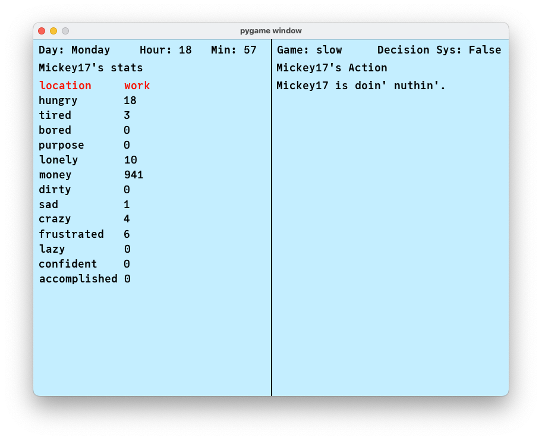

# 🧠 Mickey17: A Life Simulation AI Agent

**Mickey17** is a Python-based life simulation project featuring an AI-driven character named **Mickey**. This simulation models Mickey’s life as he navigates daily decisions influenced by time, emotional and physical needs, and his environment. The system uses a Finite State Machine (FSM) to enable Mickey to make context-aware decisions and live a believable virtual life across a full week.

---

## 🎯 Objectives

- Simulate realistic life behavior for an autonomous agent across 24 hours and 7 days.
- Build a reactive decision-making system using a Finite State Machine (FSM).
- Introduce dynamic stat-based changes that affect behavior in real time.
- Visualize Mickey's actions and stats with a Pygame interface.
- Make Mickey’s life feel human — full of habits, unpredictability, and consequences.

---

## 🧠 Project Summary

Mickey17’s agent, Mickey, has a life that dynamically adapts to changing conditions and stats. He transitions between states such as eating, working, showering, socializing, or even getting arrested — all depending on how his stats evolve.

Mickey's behavior is driven by the FSM which reacts to:

- **Time of Day**
- **Day of the Week**
- **Stat thresholds** (e.g., hunger > 10 means he eats)

Each hour, stats like hunger, loneliness, and tiredness increase or decrease randomly to simulate the unpredictability of real life. Mickey's routine differs depending on whether it's morning, working hours, or late at night. Weekends alter his behavior — he doesn't work, and only parties on Fridays or Saturdays. If frustration, sadness, and craziness all exceed 10, he even ends up in jail for a while.

Mickey's life is not scripted but responsive. Over a full week simulation, you'll see natural patterns emerge — sometimes productive, sometimes chaotic, but always entertaining.

---

## 🧪 Features

- Fully modular FSM decision-making system.
- Real-time stat monitoring and stat-driven behaviors.
- Differentiated behaviors for weekdays vs weekends.
- Randomized stat changes every in-game hour.
- Full simulation loop with visual feedback (Pygame).
- Configurable speed and time skipping with hotkeys.

---

## 🗂️ Code Structure

| File              | Description |
|-------------------|-------------|
| `hw3.py`          | Main simulation loop and UI rendering using Pygame. |
| `agent.py`        | Agent class: handles state, location, action, and stat management. |
| `agent_stat.py`   | Defines the Stat class that handles value changes and wrapping. |
| `defs.py`         | Contains stat definitions, speed settings, and color settings. |
| `decision.py`     | Core FSM logic — determines what Mickey should do and where he should be. |
| `action.py`       | Action class — stores the current activity and timing. |
| `ztime.py`        | Handles in-game time logic, such as hours, minutes, and day names. |

---

## 💬 Creator’s Note

My agent's name here is Mickey. I tried to make Mickey’s life dynamic, allowing his states and actions to change depending on the time of day. Mickey tries to balance his personal, social, and professional life, similar to how we do. His behaviors are selected by a Finite State Machine (FSM), which lets him react to changing conditions and needs throughout the day. He moves between locations like home, work, gym, bar, and even jail if things go sideways (when certain stats get too high).

The routine changes depending on the time. In the morning, he eats, showers, or prepares for work. During work hours, he works harder if he's broke, or scrolls social media when bored. In the evening, he may go to the gym if confident, socialize if lonely, or reflect at the riverside if sad. He streams movies when stable or goes to jail if emotionally overwhelmed.

At night, he cooks or showers if needed, otherwise sleeps. His FSM decides what action to take based on current stats. Transitions happen naturally — hunger leads to eating, tiredness leads to sleep, and so on. I ran a 7-day simulation to test Mickey's logic across time, and his behavior evolved realistically.

There’s still room for improvement. I'd love to add random social events or more variety across weekdays and weekends. But for now, I’m happy with how Mickey17 simulates an imperfect yet lifelike AI routine.

---

Certainly! Here's the full **Markdown section starting from**:

---

```markdown
## 🚀 How to Run

1. Make sure you have **Python 3.8+** installed.
2. Install **pygame** if needed:
   ```bash
   pip install pygame
   ```
3. Run the main simulation:
   ```bash
   python hw3.py
   ```

---

## 🕹️ Controls

| Key              | Action |
|------------------|--------|
| `Arrow Keys`     | Change stat and values manually |
| `[` / `]`        | Adjust simulation speed |
| `H` / `G`        | Skip forward/backward an hour |
| `D` / `S`        | Skip forward/backward a day |
| `M` / `N`        | Skip forward/backward a minute |
| `P`              | Pause/unpause simulation |
| `Space`          | Toggle FSM decision system on/off |
| `Q`              | Quit the game |

---
## 🖼️ Preview

Here’s what Mickey17 looks like in action:



---

## 🌟 Future Ideas

- Add random events (e.g., birthday invite, surprise guest).
- More detailed weekly schedules (e.g., specific Sunday behaviors).
- Multi-agent simulation (Mickey has friends or co-workers).
- Emotion memory or long-term mood tracking.
- Visual stat tracking or debugging console.

---

## 🙌 Special Thanks

Thanks to Mickey for staying weird, sometimes productive, and always interesting.  
And thanks to the little bit of chaos we all need to keep life (and code) exciting.

---
